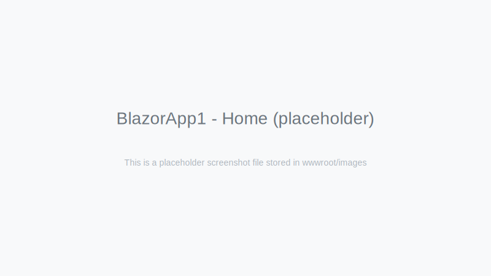
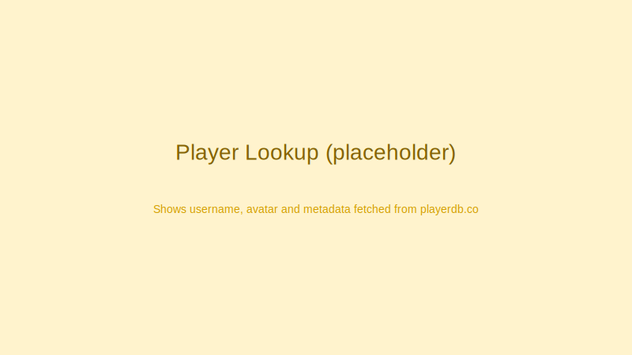
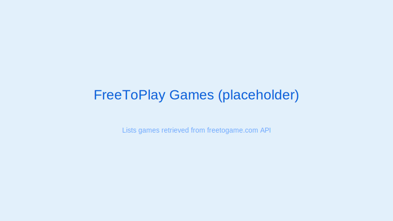

BlazorApp1
=======

Overview
--------
BlazorApp1 is a small server-hosted Blazor application (ASP.NET Core, .NET 8) demonstrating several example pages and common patterns: interactive server rendering, simple forms, external API consumption, and small client state. It is intended as a learning/demo app rather than a production system.

Key features
------------
- Home page with an example Counter component
- Counter (interactive server render mode) with configurable increment
- Weather page demonstrating streaming rendering and generated sample data
- Todo list (local state) with add / toggle functionality
-- Player lookup that calls the public playerdb.co API to resolve usernames across supported platforms (PSN lookups removed — playerdb.co does not reliably support PSN)
- Server status checker that calls the mcsrvstat.us API to query Minecraft server status (includes User-Agent handling)
- FreeToPlay games browser that consumes the freetogame.com public API and filters results

Requirements
------------
- .NET 8 SDK (the project targets net8.0)
- Network access for the pages that query third-party APIs (Player Lookup, Server Status, FreeToPlay)

Project structure
-----------------
- BlazorApp1.csproj - project file (SDK: Microsoft.NET.Sdk.Web, TargetFramework: net8.0)
- Program.cs - minimal host configuration, registers Razor Components and HttpClient, maps components with AddInteractiveServerRenderMode
- Components/
  - App.razor - root HTML shell for the app
  - Routes.razor - Router configuration
  - _Imports.razor - common usings
  - Layout/
    - MainLayout.razor - primary layout with NavMenu
    - NavMenu.razor - application navigation
  - Pages/
    - Home.razor - landing page
    - Counter.razor - interactive counter example
    - Weather.razor - streaming data example
    - Todo.razor - simple todo list using a local TodoItem model
    - PlayerLookup.razor - queries https://playerdb.co API
    - ServerStatus.razor - queries https://api.mcsrvstat.us/2/
    - FreeToPlay.razor - queries https://www.freetogame.com/api/games
- TodoItem.cs - small model used by the Todo page
- wwwroot/ - static assets (bootstrap, app.css, favicon)

How to run
----------
From the repository root (or from the BlazorApp1 directory) run:

1. dotnet restore
2. dotnet run --project BlazorApp1\BlazorApp1.csproj

By default the application will bind to the URLs shown in the console (launchSettings.json controls development URLs). Open the app in a browser and use the navigation menu.

Notes and considerations
------------------------
- This project uses server-side interactive components (AddInteractiveServerComponents / AddInteractiveServerRenderMode). It requires server hosting (not a static WebAssembly-only build).
- External API usage:
  - Player lookup uses playerdb.co. No API key is required but responses vary by platform and username.
  - Server status uses api.mcsrvstat.us. The component sends a descriptive User-Agent header to avoid 403 responses — you may want to replace the contact URL/email in Program.cs/ServerStatus.razor with appropriate values.
  - FreeToPlay uses freetogame.com public API which returns game metadata. The app performs client-side filtering only.
- The Todo list is in-memory only and not persisted. It's useful for demos but not production storage.
- The project includes build outputs (bin/ and obj/) in the repository. For a cleaner repo consider adding these to .gitignore if you plan further development.

Development
-----------
- Add services in Program.cs if you need server-side dependencies (database, authentication, caching).
- Prefer small DTO classes inside pages for demo purposes; extract shared models to a Models/ folder when they grow.

Troubleshooting
---------------
- If external API calls fail with 403 on the Server Status page, confirm the User-Agent header is being set and your machine can reach the API endpoint.
- If the app fails to start, ensure .NET 8 SDK is installed: run `dotnet --list-sdks`.

Screenshots
-----------
Small placeholder screenshots are included in the project under `wwwroot/images/`. Replace these with real screenshots if you want visual documentation in the README.

- `wwwroot/images/screenshot-home.svg` — Home / Counter
- `wwwroot/images/screenshot-player.svg` — Player Lookup
- `wwwroot/images/screenshot-freetogame.svg` — FreeToPlay games listing

You can reference them in the README (they're embedded below as examples):







API Examples
------------
Below are example requests and sample JSON responses corresponding to the APIs used by the app. These match the minimal DTOs used in the components.

1) Player Lookup — playerdb.co (PSN removed)

Request (curl):

```
curl "https://playerdb.co/api/player/{platform}/{username}"
```

Example response (trimmed):

```
{
  "success": true,
  "data": {
    "player": {
      "id": "12345678",
      "username": "exampleUser",
      "avatar": "https://example.com/avatar.png",
      "meta": { "platform": "minecraft", "extra": "value" }
    }
  }
}
```

The component maps this to a small Player DTO with Id, Username, Avatar and Meta (dictionary).

2) Server Status — api.mcsrvstat.us

Request (curl):

```
curl -H "User-Agent: BlazorApp1/1.0 (https://example.com; contact: you@example.com)" \
  "https://api.mcsrvstat.us/2/{host}"
```

Example response (trimmed):

```
{
  "online": true,
  "ip": "play.example.org",
  "port": 25565,
  "version": "1.19.2",
  "players": { "online": 12, "max": 100 },
  "motd": { "raw": ["Welcome"], "clean": ["Welcome"] }
}
```

The component converts this into a ServerInfo object (Online, Ip, Port, Version, PlayersOnline, PlayersMax, Motd).

3) FreeToPlay — freetogame.com

Request (curl):

```
curl "https://www.freetogame.com/api/games"
```

Example response (first element shown, trimmed):

```
[
  {
    "id": 452,
    "title": "Example Game",
    "thumbnail": "https://.../thumb.jpg",
    "short_description": "A short description",
    "game_url": "https://www.freetogame.com/example",
    "genre": "Shooter",
    "platform": "PC (Windows)"
  },
  ...
]
```

The component deserializes into a Game DTO and supports client-side filtering by title, platform and genre.

License
-------
No license is specified. Treat the project as sample/demo code.
